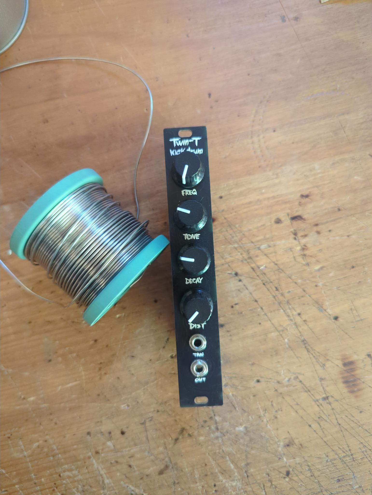
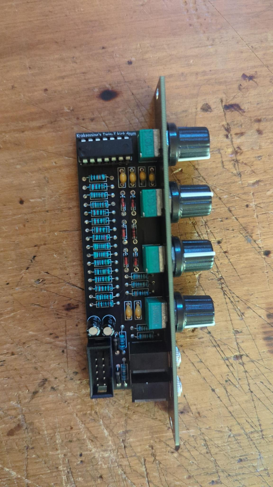

# Twin-T Kick Drum
This is a simple 4HP kick drum module based on krakenpine's design. 
If you want to know/learn more about it, check out this [YouTube video](https://www.youtube.com/watch?v=iETSEz60OVA).  
I don't post the schematic here, because it is already available in the [original repository](https://github.com/Krakenpine/krakenpine-synthing) but in my BOM I have a few changes to the original design.  
All credits go to Krakenpine!

## Build
- Order the PCBs from the PCB manufacturer of your choice.
- Check the BOM and think about which version you want to build ;)
- Order the components from your favorite electronics supplier.
- Solder the components to the PCB and mount the panel.

